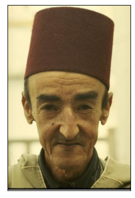
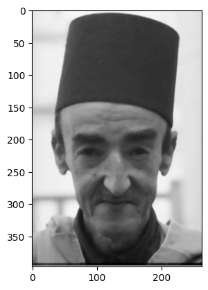
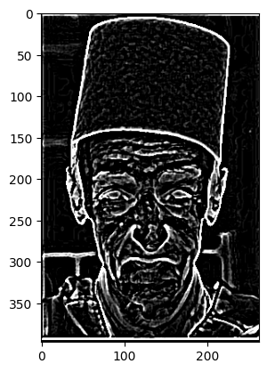
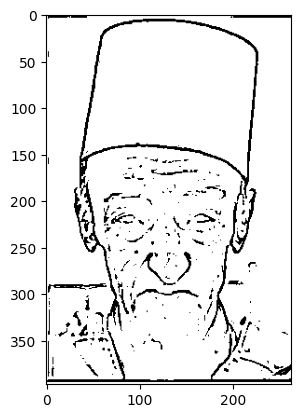
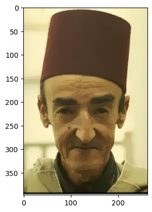
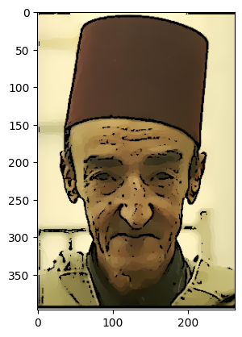
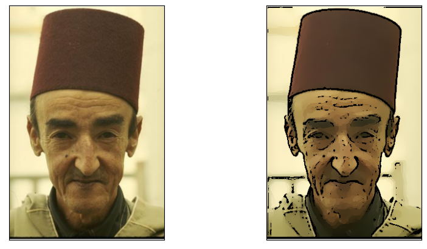
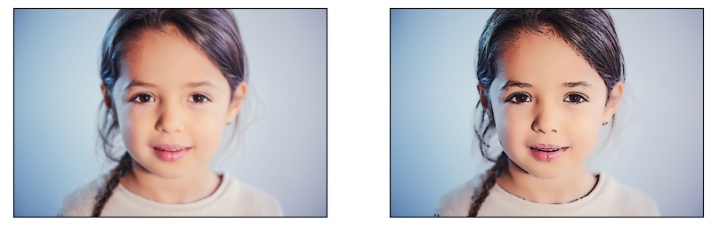
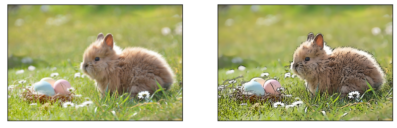

# Cartoonizing images

## Hyperparameters and filters

### Median filter

- The `MEDIAN_K` hyperparameter is the kernel size of the median filter. Which is the size of the window being extracted from the image to calculate the median value to assign each pixel. The median filter is used to reduce the salt and pepper noise in the image without smoothing the edges.

> The median filter uses `BORDER_REPLICATE` internally to cope with border pixels
> Example: `aaaaaa|abcdefgh|hhhhhhh`

### Laplacian filter

- The `LAPLACE_K` hyperparameter is the kernel size of the Laplacian filter. The Laplacian filter is used to detect the edges in the image. The algorithm operates by convolving a kernel of weights with each grid cell and its neighbours in an image.

> Four `3x3` sized filters and one `5x5` filter are available for selection. The weights of the kernels are as follows:
>
>![Laplacian kernels][laplacian-kernels]
>
>The function calculates the Laplacian of the source image by adding up the second x and y derivatives calculated using the Sobel operator:
>
>![Laplacian formula][laplacian-formula]

### Binary threshold

- The `THRESHOLD` hyperparameter is the threshold value for the edge detection. The threshold value is the minimum value of the edge pixel to be considered as an edge. The higher the threshold value, the less edges will be detected.

### Bilateral filter

>The basic idea underlying bilateral filtering is to do in the range of an image what traditional filters do in its domain. Two pixels can be close to one another, that is, occupy nearby spatial location, or they can be similar to one another, that is, have nearby values, possibly in a perceptually meaningful fashion. It replaces the pixel value at x with an average of similar and nearby pixel values. In smooth regions, pixel values in a small neighborhood are similar to each other, and the bilateral filter acts essentially as a standard domain filter, averaging away the small, weakly correlated differences between pixel values caused by noise. Thus, good filtering behavior is achieved at the boundaries, thanks to the domain component of the filter, and crisp edges are preserved at the same time, thanks to the range component.

- The `DIAMETER` hyperparameter is the diameter of the pixel neighborhood used during the bilateral filter.  Large filters (d > 5) are very slow because the filter is non-linear, so it is recommended to use d=5 for real-time applications, and perhaps d=9 for offline applications that need heavy noise filtering.

- The `SIGMA_COLOR` hyperparameter is the filter sigma in the color space.  A larger value of the parameter means that farther colors within the pixel neighborhood (see sigmaSpace) will be mixed together, resulting in larger areas of semi-equal color.

- The `SIGMA_SPACE` hyperparameter is the filter sigma in the coordinate space. A larger value of the parameter means that farther pixels will influence each other as long as their colors are close enough (see sigmaColor). When d>0, it specifies the neighborhood size regardless of sigmaSpace. Otherwise, d is proportional to sigmaSpace.

- The `REPS` hyperparameter is the number of repetitions for the bilateral filter.

>For simplicity, you can set the 2 sigma values to be the same. If they are small (< 10), the filter will not have much effect, whereas if they are large (> 150), they will have a very strong effect, making the image look "cartoonish" which is the effect we want. However, large sigma values also result in a very slow filter, so we apply a relatively small value for both and then apply the filter multiple times to get the cartoon effect.

## Steps of the algorithm in code

## Imports

```python
import cv2
import numpy as np
from matplotlib import pyplot as plt
```

## Constants

These are used as parameters for the filters. Tweaking them would give different results.

```python
MEDIAN_K = 5
LAPLACE_K = 5
THRESHOLD = 180

DIAMETER = 9
SIGMA_COLOR = 9
SIGMA_SPACE = 7

REPS = 10
```

### Reading the image

```python
img = cv2.imread('img/a.png')
ax = plt.imshow(img[:,:,::-1])
ax.axes.get_xaxis().set_visible(False)
ax.axes.get_yaxis().set_visible(False)
plt.show()
```



### 1.1.1 Noise Reduction Using Median Filter

```python
edg_img = cv2.cvtColor(img, cv2.COLOR_BGR2GRAY)
edg_img = cv2.medianBlur(edg_img, MEDIAN_K)
plt.imshow(edg_img, cmap='gray')
plt.show()
```



### 1.1.2 Edge Detection Using Laplacian Filter

```python
edg_img = cv2.Laplacian(edg_img, cv2.CV_8U, ksize=LAPLACE_K)
plt.imshow(edg_img, cmap='gray')
plt.show()
```



### Threshold

```python
thr_img = cv2.threshold(edg_img, THRESHOLD, 255, cv2.THRESH_BINARY)[1]
thr_img = 255 * (thr_img == 0).astype(np.uint8)
plt.imshow(thr_img, cmap='gray')
plt.show()
```



## 1.2 Generating a color painting and a cartoon

```python
bi_img = cv2.bilateralFilter(img, DIAMETER, SIGMA_COLOR, SIGMA_SPACE)
for i in range(REPS):
    bi_img = cv2.bilateralFilter(bi_img, DIAMETER, SIGMA_COLOR, SIGMA_SPACE)
plt.imshow(bi_img[:,:,::-1])
plt.show()
```



## Final Result

```python
res = bi_img * (np.repeat(thr_img,3, axis=-1).reshape(bi_img.shape) // 255)
plt.imshow(res[:,:,::-1])
plt.show()
```



## Defining the steps in a function

```python
def cartoonize(path: str):
    # Read image
    img = cv2.imread(path)

    # Convert to grayscale
    edg_img = cv2.cvtColor(img, cv2.COLOR_BGR2GRAY)
    edg_img = cv2.medianBlur(edg_img, MEDIAN_K)

    # Detect edges and threshold
    edg_img = cv2.Laplacian(edg_img, cv2.CV_8U, ksize=LAPLACE_K)
    edg_img = cv2.threshold(edg_img, THRESHOLD, 255, cv2.THRESH_BINARY)[1]
    edg_img = 255 * (edg_img == 0).astype(np.uint8)

    # Apply bilateral filter
    bi_img = cv2.bilateralFilter(img, DIAMETER, SIGMA_COLOR, SIGMA_SPACE)
    for i in range(REPS - 1):
        bi_img = cv2.bilateralFilter(bi_img, DIAMETER, SIGMA_COLOR, SIGMA_SPACE)

    # sketch over painting
    return bi_img * (np.repeat(edg_img,3, axis=-1).reshape(bi_img.shape) // 255)

```

```python
def view(path: str):
    fig, axs = plt.subplots(1, 2, figsize=(10, 5))
    axs[0].imshow(cv2.imread(path)[:,:,::-1])
    axs[0].axes.get_xaxis().set_visible(False)
    axs[0].axes.get_yaxis().set_visible(False)
    axs[1].imshow(cartoonize(path)[:,:,::-1])
    axs[1].axes.get_xaxis().set_visible(False)
    axs[1].axes.get_yaxis().set_visible(False)
    plt.show()
```

## Testing on different pictures of different objects and noise intensity

```python
view('img/a.png')
```



```python
view('img/b.jpg')
```



```python
view('img/c.jpg')
```



[laplacian-kernels]: laplace-k.png
[laplacian-formula]: laplace-f.png
